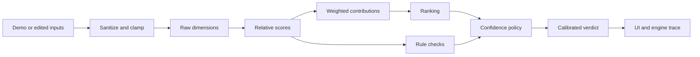

# Career Decision Engine

A dependency-free decision-support tool for comparing fictional job offers and career paths under uncertainty.

This project does not choose the best job. It structures an ambiguous comparison, makes assumptions visible, and uses calibrated language when the inputs do not support a clean answer.


## Why this exists

Career decisions often mix measurable inputs, personal priorities, and facts that cannot be fully verified before committing. A weighted score can help, but it can also hide risks such as burnout, equity uncertainty, commute burden, or fragile downside assumptions.

I built this as a small decision-system artifact. The goal is to show how ambiguous tradeoffs can be translated into explicit logic, tested against edge cases, and presented without false certainty.

## What it demonstrates

- Relative scoring across compensation, growth, lifestyle, stability, and mission fit
- Rule checks that surface caveats separately from the weighted score
- Confidence labels for clear leads, slight edges, and close calls
- Editable demo inputs with provenance labels
- A guided user-entry workflow for job offers and career paths
- Preference calibration that derives starting weights from tradeoff answers
- An engine trace that shows how inputs become a final verdict
- Tests for scoring behavior, validation warnings, caveats, and generated output quality

## Screenshots

### Guided workflow

The custom workflow asks the user to choose a comparison type, name the options, enter estimates, answer tradeoff questions, and review the assumptions before running the engine.


### Assumption review

Before the result, the app shows the derived weights and the facts it cannot verify. This keeps the output tied to the user's inputs rather than presenting the result as an objective recommendation.


### Engine trace

The trace panel shows how the top option moves through the scoring pipeline: sanitized inputs, raw dimensions, relative scores, weighted contributions, rule checks, and confidence policy.


### Close-call behavior

When the score margin is too small, the tool says that it cannot cleanly separate the top options under the current weighting.


## Run locally

Open `index.html` in a browser.

No install step is required. The app uses plain HTML, CSS, and JavaScript modules.

To run the browser test page, open:

```text
tests/decisionEngine.test.html
```

If Node is available, run the broader validation sweeps:

```bash
node tests/engine.sweep.mjs
node tests/output-quality.sweep.mjs
node tests/combination-matrix.sweep.mjs
```

## Project structure

```text
career-decision-engine/
  index.html
  src/
    app.js
    decisionEngine.js
    demoScenarios.js
    intakeModel.js
    styles.css
    weightCalibration.js
  docs/
    ENGINE_NOTES.md
  assets/
    screenshots used by README
  tests/
    decisionEngine.test.html
    decisionEngine.test.js
    combination-matrix.sweep.mjs
    engine.sweep.mjs
    output-quality.sweep.mjs
```

## Architecture

The engine is separate from the UI.

- `decisionEngine.js` owns input sanitization, weight normalization, dimension scoring, caveat checks, confidence labels, verdict generation, provenance, and validation warnings.
- `intakeModel.js` defines the guided workflow fields, defaults, option naming behavior, and review warnings.
- `weightCalibration.js` converts tradeoff answers into normalized starting weights.
- `app.js` renders demos, guided intake, editable inputs, scoring detail, rule-check detail, methodology, limitations, and the engine trace from the engine output.
- `demoScenarios.js` defines fictional scenarios, weight presets, field labels, and UI hints.
- `docs/ENGINE_NOTES.md` documents the formulas, caveats, confidence policy, and validation posture.
- `tests/engine.sweep.mjs` checks engine invariants across scenarios and presets.
- `tests/output-quality.sweep.mjs` stress-tests generated verdict quality against extreme, close-call, high-risk, and invalid-input cases.
- `tests/combination-matrix.sweep.mjs` runs a wider matrix of job-offer and career-path archetypes against preset and derived weights.

The UI does not recalculate the decision result. It asks the engine for an evaluation and renders the returned structure.

The guided workflow is a thin layer above the same engine:

1. Choose specific job offers or career paths.
2. Name two or three options.
3. Enter guided inputs.
4. Answer tradeoff questions that derive starting weights.
5. Review assumptions and cannot-verify items.
6. Run the comparison through the same scoring, caveat, confidence, and trace logic as the demo scenarios.



## Decision model

Each option is scored across five dimensions:

- compensation
- growth
- lifestyle
- stability
- mission fit

Dimension scores are relative to the current comparison set. A score of `100` means strongest among the compared options on that dimension. It does not mean objectively excellent, market-verified, or predictive.

The weighted score is calculated from normalized weights:

```text
weighted score =
  compensation score * compensation weight +
  growth score * growth weight +
  lifestyle score * lifestyle weight +
  stability score * stability weight +
  mission score * mission weight
```

Rule checks run separately from the weighted score. This keeps caveats visible when an option looks attractive numerically.

## Validation

The current checks cover:

- tied values produce neutral relative scores
- zero custom weights fall back to the Balance First preset
- weighted contributions add back to the total weighted score
- rankings stay sorted across demo scenarios and presets
- out-of-range inputs are clamped with validation warnings
- job-offer caveats trigger for burnout and equity concentration
- career-path caveats trigger for downside risk
- edited fields are marked as `You entered`
- guided user options can be built and evaluated by the same engine
- derived preference weights normalize to 100
- low-risk and lifestyle preference answers shift the expected dimensions
- close-call verdicts say the tool cannot cleanly separate the top options
- generated explanations avoid `undefined`, `NaN`, and fake precision under extreme inputs
- cannot-verify items are always returned
- broad input combinations preserve bounded scores, sorted rankings, calibrated verdict text, and rule-check coverage

Latest local validation status:

```text
Browser test page after guided workflow: 27/27 passed
Engine invariant sweep: 81/81 passed
Output-quality sweep: 56/56 passed
Combination matrix sweep: 6309/6309 passed across 700 evaluated comparisons
```

## Limitations

- All demo data is fictional.
- Scores are not salary benchmarks or labor-market truth.
- Rule checks are heuristics, not verified facts.
- The tool cannot verify manager quality, team culture, equity liquidity, future openings, true workload, or negotiation room.
- The output depends on the selected weighting and current inputs.
- It is decision support, not career advice.

## Why this is relevant

The useful part of this project is not the career domain by itself. The useful part is the validation posture: define the inputs, normalize them, expose the assumptions, test edge cases, and keep confidence proportional to the evidence.

That is the same operating style I bring from regulated quality work into AI systems work: traceability, failure-mode thinking, explicit uncertainty, and quality gates before final claims.
